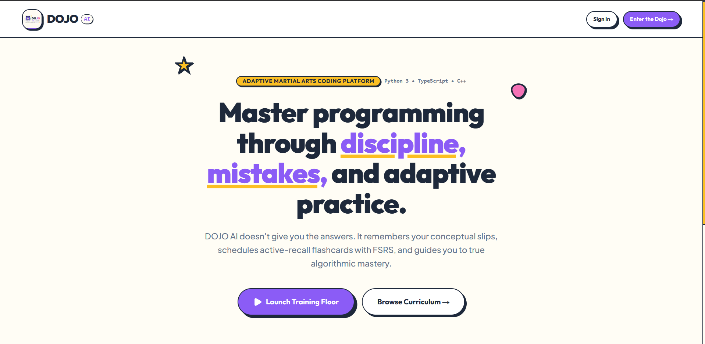

# 🥋 DOJO AI — Adaptive Multi-Language Coding Tutor & Mastery Engine

<div align="center">



**Master Programming Through Real Sandboxed Practice, Cognitive Mistake Tracking, and DeepSeek AI Mentorship.**

[](file:///z:/Dojo%20AI/src/tests)
[](https://nextjs.org/)
[](https://www.typescriptlang.org/)
[](https://integrate.api.nvidia.com)
[](LICENSE)

</div>

---

## ⚡ The DOJO Learning Loop

DOJO AI replaces passive video lectures and surface-level tutorials with an active **Cognitive Autopsy & Deliberate Practice Engine**:

```
┌─────────────────────────────────────────────────────────────────────────────┐
│                          DOJO COGNITIVE LOOP                                │
└──────────────────────────────────────┬──────────────────────────────────────┘
                                       │
  ┌───────────────┬────────────────────┼────────────────────┬───────────────┐
  ▼               ▼                    ▼                    ▼               ▼
[ Attempt ] ──▶ [ Mistake ] ────▶ [ Cognitive ] ─────▶ [ Spaced ] ───▶ [ Belt ]
  Workouts        Autopsy           Recall Flashcards    Repetition      Promotion
  in Sandbox      DeepSeek Sensei   FSRS Algorithm       Adaptive        8 Tiers
  4 Languages     Diagnostics       Active Recall        Practice        White ➔ Black
```

---

## 🌟 Key Subsystems & Features

### 1. 🥋 Structured Workouts & Adaptive Practice Arena
- **Four-Language Polyglot Track**: Dedicated practice track supporting **C++ (GCC 13)**, **Java 21 OpenJDK**, **JavaScript (Node 20 / ES2024)**, and **Python 3.12**.
- **Adaptive Shuffle Engine**: Dynamically distributes questions based on learner history:
  - **70% Current Progression Tier** (Beginner, Intermediate, Advanced)
  - **20% Revision** (Reintroduces previously failed questions)
  - **10% Stretch Challenges** (Higher difficulty promotion problems)
  - Non-repeating memory buffer prevents immediate question fatigue.
- **Split-Screen IDE Workspace**:
  - Independent scrolling left pane for problem specifications, input/output formats, sample examples, and constraints.
  - Monaco code editor with real-time syntax highlighting, custom stdin execution (**Run Code**), and assertion batch evaluation (**Run Tests**).
  - Interactive Test Results Inspector showing individual `Test 1`, `Test 2` selectors, pass/fail status badges, actual vs expected outputs, latency telemetry, and masked hidden tests.

### 2. 🤖 Isolated Sandboxed Code Execution Engine
- **Universal Multi-Language Execution**:
  - **Node.js VM Isolation**: Executes JavaScript/TypeScript functions in isolated V8 contexts, capturing structured return values (`[2, 4, 6]`, objects, primitives) directly.
  - **Python 3.12 Subprocess Sandbox**: Evaluates Python functions with automated type and JSON serialization.
  - **C++20 & Java 21 Run Harnesses**: Language-native compilation and assertion printing with OneCompiler API integration.
- **Deep Structural Equality Comparison**:
  - Type-aware comparison for arrays, objects, strings, numbers, and booleans.
  - Normalizes harmless JSON key-order differences while deterministically failing incorrect algorithms.

### 3. 🧠 Sensei AI & Secondary Evaluation Layer
- **Progressive Hint Scaffolding**:
  - **Level 1**: Conceptual direction
  - **Level 2**: Algorithmic approach
  - **Level 3**: Implementation guidance
  - Never reveals full solutions prematurely unless explicitly unlocked.
- **Secondary Semantic Diagnostics**: Powered by NVIDIA DeepSeek-V4-Pro to classify failed submissions (`genuinely_incorrect_logic`, `formatting_difference`, `runtime_exception`, `contract_mismatch`).

### 4. 🗃️ Mistake Memory & Spaced Repetition (FSRS)
- **Automatic Cognitive Autopsies**: Fingerprints error patterns (off-by-one loops, zero-division, reference mutability) and generates tailored active-recall flashcards.
- **Free Spaced Repetition Scheduler (FSRS)**: Tracks memory stability, difficulty, and review schedules with *Again / Hard / Good / Easy* rating adjustments.

### 5. 🛡️ Admin Content Management & Telemetry Portal
- **Structured Workouts Ledger**: Inspect, moderate, and toggle active status for polyglot exercises.
- **Canonical Verification**: Runs full test suites against canonical solutions in the exact same sandbox environment used by learners.
- **AI Generator Queue**: Synthesizes high-entropy, diverse algorithmic workouts across multiple languages and topics.

---

## 🛠️ Architecture & Tech Stack

| Layer | Technologies |
|---|---|
| **Framework & Frontend** | Next.js 16.3.3 (Turbopack, App Router, React 19) |
| **Styling & Design System** | Tailwind CSS, Lucide Icons, Martial Arts Neo-Brutalism Theme |
| **Code Editor** | Monaco Editor (`@monaco-editor/react`) |
| **Execution Sandbox** | Node.js VM, Python 3.12 Runner, OneCompiler REST API |
| **AI Mentorship Engine** | NVIDIA DeepSeek (`deepseek-ai/deepseek-v4-pro-0813`) |
| **Spaced Repetition** | `ts-fsrs` (Free Spaced Repetition Scheduler v4) |
| **Schema & Validation** | Zod 3.x, TypeScript 5.x Strict Mode |
| **Test Runner** | Node.js Native Test Runner (`tsx --test`) |

---

## 🚀 Getting Started

### Prerequisites
- Node.js 20.x or higher
- Python 3.12 (optional for local Python runner fallback)
- npm or pnpm

### Installation

```bash
# 1. Clone the repository
git clone https://github.com/Ashwinnethan64-maker/Dojo-Ai-Tutor.git
cd "Dojo AI"

# 2. Install dependencies
npm install

# 3. Configure environment variables (.env.local)
cp .env.example .env.local
```

### Environment Variables

```env
# NVIDIA DeepSeek API Key (Optional for live AI hints and workout generation)
NVIDIA_API_KEY=your_nvidia_api_key_here
NVIDIA_BASE_URL=https://integrate.api.nvidia.com/v1

# OneCompiler API Key (Optional for remote polyglot compilation)
ONECOMPILER_API_KEY=your_onecompiler_key_here
```

### Running Locally

```bash
# Start Next.js development server
npm run dev

# Open http://localhost:3000 in your browser
```

---

## 🧪 Quality & Verification Pipeline

```bash
# Run automated test suite (60 unit & integration tests)
npm test

# Run TypeScript type safety check
npm run typecheck

# Run ESLint validation
npm run lint

# Compile production build
npm run build
```

---

## 📁 Repository Directory Structure

```
z:/Dojo AI/
├── src/
│   ├── app/
│   │   ├── (dojo)/
│   │   │   ├── dashboard/              # Learner command center
│   │   │   ├── workouts/               # Curriculum workout catalog & IDE
│   │   │   ├── structured-workouts/    # 4-language structured practice arena
│   │   │   ├── flashcards/             # FSRS spaced repetition review
│   │   │   ├── mistakes/               # Mistake memory & cognitive autopsies
│   │   │   └── progress/               # Belt progression & skill mastery
│   │   ├── admin/
│   │   │   ├── structured-workouts/    # Structured workout moderation
│   │   │   ├── ai-generator/           # AI workout synthesizer queue
│   │   │   └── test-suites/            # Telemetry & canonical verifications
│   │   └── api/
│   │       ├── executions/             # Universal code execution sandbox
│   │       ├── ai/                     # Hints & workout generation routes
│   │       └── structured-workouts/    # Adaptive shuffle practice API
│   ├── components/
│   │   ├── dojo/                       # Shared DOJO UI components & sidebar
│   │   └── admin/                      # Admin console components & sidebar
│   ├── lib/
│   │   ├── execution/                  # Node VM, Python & OneCompiler runners
│   │   ├── structured-workouts/        # Shuffle engine, types & service
│   │   ├── ai/                         # DeepSeek client, hints & evaluators
│   │   ├── fsrs/                       # Spaced repetition scheduling
│   │   └── progression/                # Belt hierarchy & XP algorithms
│   └── tests/                          # 60 automated unit & integration tests
├── public/                             # Static assets & icons
├── README.md                           # Documentation
└── package.json
```

---

## 📜 License

Distributed under the MIT License. Built with ❤️ for developers mastering deliberate programming.
