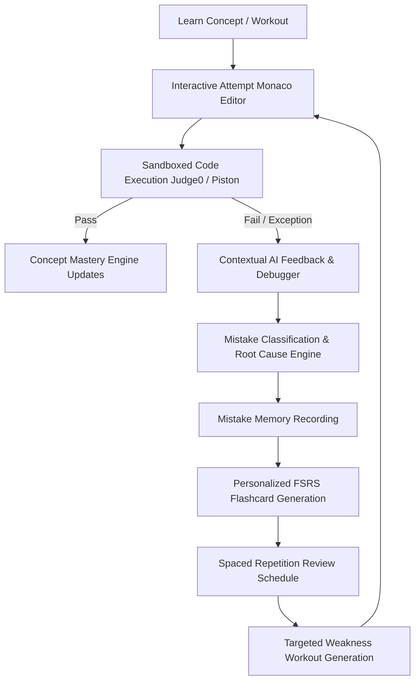

# DOJO AI — System Architecture Specification

## 1. System Overview & Core Philosophy
**DOJO AI** is an adaptive, high-retention coding-learning platform. It breaks away from traditional "read-and-solve" or "cheat-with-ChatGPT" loops by embedding continuous mistake tracking, progressive cognitive scaffolding, and spaced repetition directly into the active coding experience.

### Core Learning Loop


---

## 2. Layered Architecture

```
┌─────────────────────────────────────────────────────────────┐
│                      FRONTEND LAYER                         │
│  Next.js App Router (TypeScript) + Tailwind CSS + Lucide     │
│  - Monaco Editor Workspace (Multi-panel layout)             │
│  - Adaptive Dashboard (Belts, Streaks, Weak Areas)          │
│  - Spaced Repetition Flashcard Player                       │
│  - Progressive AI Tutor / Hint Interface                    │
└──────────────────────────────┬──────────────────────────────┘
                               │ HTTP / Server Actions / REST
┌──────────────────────────────▼──────────────────────────────┐
│                    API & ROUTE HANDLERS                     │
│  /api/executions          /api/workouts/:id/attempt         │
│  /api/ai/* (Tutor, Hint, Debug, Mistake, Workout)           │
│  /api/flashcards/*        /api/mastery      /api/dashboard  │
└──────────────────────────────┬──────────────────────────────┘
                               │
       ┌───────────────────────┼───────────────────────┐
       ▼                       ▼                       ▼
┌───────────────┐      ┌───────────────┐      ┌───────────────┐
│  AI SERVICES  │      │ EXECUTION GW  │      │  DATA ACCESS  │
│  OpenAI LLM   │      │ Isolated      │      │ Supabase SSR  │
│  (Structured  │      │ Sandbox       │      │ PostgreSQL    │
│   JSON Output)│      │ (Judge0)      │      │ RLS Secured   │
└───────────────┘      └───────────────┘      └───────────────┘
```

### 2.1 Presentation & Editor Layer
- **Monaco Code Editor**: Professional-grade editor supporting syntax highlighting, auto-formatting, error markers, and keybindings.
- **Dojo Design System**: Premium, technical, minimalist aesthetic with crisp typography, light canvas paired with deep dark editor viewports, royal purple action accents (`#6366F1` / `#7C3AED`), and authentic martial arts belt indicators (White $\to$ Yellow $\to$ Orange $\to$ Green $\to$ Blue $\to$ Purple $\to$ Brown $\to$ Black).

### 2.2 Domain Service Layer (`/src/lib/services`)
Each domain maintains clean isolation and single responsibility:
- **`ExecutionService`**: Handles sandbox orchestration, limits CPU/memory/time, parses stdout/stderr, and grades visible & hidden test suites.
- **`MistakeService`**: Fingerprints error patterns, maintains historical occurrence frequencies, calculates error velocity, and associates weaknesses with specific granular concepts.
- **`FSRSService`**: Implements Free Spaced Repetition Scheduling (FSRS) to calculate review intervals, stability, difficulty, and retrievability.
- **`MasteryService`**: Computes holistic mastery scores per concept considering failure rates, hint usage, time delta, retention, and transferability to unseen challenges.
- **`ProgressionService`**: Governs XP, streaks, belt eligibility criteria, and workout unlocking.

### 2.3 AI Agent Orchestration Layer (`/src/lib/ai`)
Decoupled agent micro-services utilizing strict Zod schemas and OpenAI Structured Outputs:
- **`TutorAgent`**: Socratic teaching, conceptual explanations without solution leakage.
- **`HintAgent`**: Multi-tiered progressive hints (L1 Conceptual $\to$ L2 Directional $\to$ L3 Near-solution $\to$ L4 Detailed explanation $\to$ L5 Solution reveal).
- **`DebuggerAgent`**: Pinpoints logic traps and execution deviations.
- **`MistakeClassifier`**: Normalizes errors into standard taxonomy (`syntax_error`, `off_by_one`, `loop_error`, `scope_error`, etc.).
- **`FlashcardGenerator`**: Transforms concrete mistakes into active-recall flashcards.
- **`WorkoutGenerator`**: Synthesizes bespoke challenges targeting identified learner weak points.
- **`CodeReviewAgent` & `ProgressAgent`**: Idiomatic feedback and longitudinal growth synthesis.

### 2.4 Code Execution Sandbox
- **Zero Local Execution**: Arbitrary user code is strictly prohibited from running on application server runtimes.
- **Isolated Sandbox**: Sandboxed worker instances (Judge0 CE/Piston) with strict limits:
  - CPU Limit: 2.0s wall time, 1.0s CPU time
  - Memory Limit: 128 MB
  - Output Cap: 32 KB stdout/stderr
  - Network: Strictly disabled inside execution sandbox.

---

## 3. Scalability & Multi-Language Readiness
While Python is the flagship MVP language, all database schemas, API contracts, Monaco configurations, execution drivers, and AI evaluators are parameterized by `language_id` (e.g. `python`, `javascript`, `typescript`, `cpp`, `java`, `rust`, `go`, `csharp`, `sql`). Adding a new language requires zero schema refactoring.
