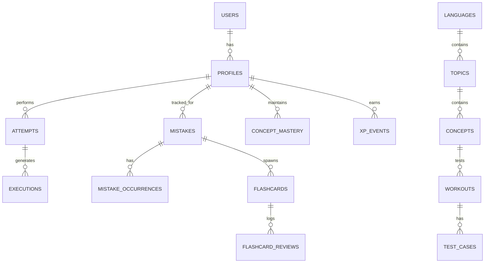

# DOJO AI — Database Architecture & Schema Specification

## 1. Overview & Storage Philosophy
DOJO AI uses **PostgreSQL via Supabase** with Row-Level Security (RLS) enabled on all user-scoped tables. The schema is fully normalized, supports multiple programming languages natively, and enforces referential integrity.

---

## 2. Core Entities & Relationships



---

## 3. Detailed Schema Definition (DDL)

```sql
-- Enums
CREATE TYPE belt_tier AS ENUM ('white', 'yellow', 'orange', 'green', 'blue', 'purple', 'brown', 'black');
CREATE TYPE workout_difficulty AS ENUM ('intro', 'easy', 'medium', 'hard', 'master');
CREATE TYPE execution_status AS ENUM ('pending', 'passed', 'failed', 'runtime_error', 'compile_error', 'time_limit_exceeded', 'memory_limit_exceeded');
CREATE TYPE mistake_category AS ENUM (
  'syntax_error', 'runtime_error', 'type_error', 'logic_error', 
  'conceptual_error', 'algorithm_error', 'off_by_one', 'condition_error', 
  'loop_error', 'function_error', 'scope_error', 'data_structure_error', 
  'api_usage_error', 'complexity_error', 'debugging_behavior', 'style_issue', 'other'
);
CREATE TYPE flashcard_state AS ENUM ('new', 'learning', 'review', 'relearning');

-- 1. Profiles & Progression
CREATE TABLE profiles (
    id UUID PRIMARY KEY REFERENCES auth.users(id) ON DELETE CASCADE,
    username TEXT UNIQUE NOT NULL,
    display_name TEXT,
    avatar_url TEXT,
    current_language_id TEXT NOT NULL DEFAULT 'python',
    current_belt belt_tier NOT NULL DEFAULT 'white',
    xp INT NOT NULL DEFAULT 0,
    streak_count INT NOT NULL DEFAULT 0,
    longest_streak INT NOT NULL DEFAULT 0,
    last_active_at TIMESTAMPTZ NOT NULL DEFAULT NOW(),
    created_at TIMESTAMPTZ NOT NULL DEFAULT NOW(),
    updated_at TIMESTAMPTZ NOT NULL DEFAULT NOW()
);

-- 2. Curriculum & Language Structure
CREATE TABLE languages (
    id TEXT PRIMARY KEY, -- e.g., 'python', 'javascript', 'cpp'
    name TEXT NOT NULL,
    monaco_id TEXT NOT NULL,
    judge0_id INT NOT NULL,
    is_active BOOLEAN NOT NULL DEFAULT true,
    created_at TIMESTAMPTZ NOT NULL DEFAULT NOW()
);

CREATE TABLE topics (
    id UUID PRIMARY KEY DEFAULT gen_random_uuid(),
    language_id TEXT NOT NULL REFERENCES languages(id) ON DELETE CASCADE,
    slug TEXT NOT NULL,
    title TEXT NOT NULL,
    description TEXT,
    order_index INT NOT NULL,
    belt_tier belt_tier NOT NULL DEFAULT 'white',
    created_at TIMESTAMPTZ NOT NULL DEFAULT NOW(),
    UNIQUE(language_id, slug)
);

CREATE TABLE concepts (
    id UUID PRIMARY KEY DEFAULT gen_random_uuid(),
    topic_id UUID NOT NULL REFERENCES topics(id) ON DELETE CASCADE,
    slug TEXT NOT NULL,
    name TEXT NOT NULL,
    description TEXT,
    prerequisites UUID[] DEFAULT '{}',
    order_index INT NOT NULL,
    created_at TIMESTAMPTZ NOT NULL DEFAULT NOW(),
    UNIQUE(topic_id, slug)
);

-- 3. Workouts & Test Cases
CREATE TABLE workouts (
    id UUID PRIMARY KEY DEFAULT gen_random_uuid(),
    concept_id UUID NOT NULL REFERENCES concepts(id) ON DELETE CASCADE,
    language_id TEXT NOT NULL REFERENCES languages(id) ON DELETE CASCADE,
    slug TEXT NOT NULL,
    title TEXT NOT NULL,
    description TEXT NOT NULL,
    learning_objective TEXT NOT NULL,
    difficulty workout_difficulty NOT NULL DEFAULT 'easy',
    starter_code TEXT NOT NULL,
    solution_code TEXT NOT NULL,
    instructions TEXT NOT NULL,
    order_index INT NOT NULL,
    is_targeted_challenge BOOLEAN NOT NULL DEFAULT false,
    created_at TIMESTAMPTZ NOT NULL DEFAULT NOW(),
    UNIQUE(language_id, slug)
);

CREATE TABLE workout_test_cases (
    id UUID PRIMARY KEY DEFAULT gen_random_uuid(),
    workout_id UUID NOT NULL REFERENCES workouts(id) ON DELETE CASCADE,
    stdin TEXT NOT NULL DEFAULT '',
    expected_output TEXT NOT NULL,
    is_hidden BOOLEAN NOT NULL DEFAULT false,
    order_index INT NOT NULL DEFAULT 0,
    created_at TIMESTAMPTZ NOT NULL DEFAULT NOW()
);

CREATE TABLE workout_hints (
    id UUID PRIMARY KEY DEFAULT gen_random_uuid(),
    workout_id UUID NOT NULL REFERENCES workouts(id) ON DELETE CASCADE,
    level INT NOT NULL CHECK (level BETWEEN 1 AND 5),
    content TEXT NOT NULL,
    UNIQUE(workout_id, level)
);

-- 4. Attempts & Execution Logs
CREATE TABLE attempts (
    id UUID PRIMARY KEY DEFAULT gen_random_uuid(),
    user_id UUID NOT NULL REFERENCES profiles(id) ON DELETE CASCADE,
    workout_id UUID NOT NULL REFERENCES workouts(id) ON DELETE CASCADE,
    code TEXT NOT NULL,
    status execution_status NOT NULL DEFAULT 'pending',
    passed_tests INT NOT NULL DEFAULT 0,
    total_tests INT NOT NULL DEFAULT 0,
    time_spent_seconds INT NOT NULL DEFAULT 0,
    hints_revealed INT NOT NULL DEFAULT 0,
    created_at TIMESTAMPTZ NOT NULL DEFAULT NOW()
);

CREATE TABLE executions (
    id UUID PRIMARY KEY DEFAULT gen_random_uuid(),
    attempt_id UUID REFERENCES attempts(id) ON DELETE CASCADE,
    user_id UUID NOT NULL REFERENCES profiles(id) ON DELETE CASCADE,
    language_id TEXT NOT NULL REFERENCES languages(id),
    source_code TEXT NOT NULL,
    status execution_status NOT NULL,
    stdout TEXT,
    stderr TEXT,
    compile_output TEXT,
    execution_time_ms INT,
    memory_used_kb INT,
    created_at TIMESTAMPTZ NOT NULL DEFAULT NOW()
);

-- 5. Mistake Memory & Diagnostics
CREATE TABLE mistakes (
    id UUID PRIMARY KEY DEFAULT gen_random_uuid(),
    user_id UUID NOT NULL REFERENCES profiles(id) ON DELETE CASCADE,
    concept_id UUID NOT NULL REFERENCES concepts(id) ON DELETE CASCADE,
    category mistake_category NOT NULL,
    fingerprint TEXT NOT NULL, -- normalized hash/pattern
    title TEXT NOT NULL,
    description TEXT NOT NULL,
    occurrences INT NOT NULL DEFAULT 1,
    severity INT NOT NULL DEFAULT 1 CHECK (severity BETWEEN 1 AND 5),
    last_occurred_at TIMESTAMPTZ NOT NULL DEFAULT NOW(),
    first_occurred_at TIMESTAMPTZ NOT NULL DEFAULT NOW(),
    is_resolved BOOLEAN NOT NULL DEFAULT false,
    UNIQUE(user_id, fingerprint)
);

CREATE TABLE mistake_occurrences (
    id UUID PRIMARY KEY DEFAULT gen_random_uuid(),
    mistake_id UUID NOT NULL REFERENCES mistakes(id) ON DELETE CASCADE,
    attempt_id UUID REFERENCES attempts(id) ON DELETE SET NULL,
    code_snippet TEXT NOT NULL,
    error_message TEXT,
    ai_explanation TEXT NOT NULL,
    created_at TIMESTAMPTZ NOT NULL DEFAULT NOW()
);

-- 6. Spaced Repetition Flashcards (FSRS-based)
CREATE TABLE flashcards (
    id UUID PRIMARY KEY DEFAULT gen_random_uuid(),
    user_id UUID NOT NULL REFERENCES profiles(id) ON DELETE CASCADE,
    concept_id UUID NOT NULL REFERENCES concepts(id) ON DELETE CASCADE,
    source_mistake_id UUID REFERENCES mistakes(id) ON DELETE SET NULL,
    front_question TEXT NOT NULL,
    back_answer TEXT NOT NULL,
    explanation TEXT NOT NULL,
    code_context TEXT,
    -- FSRS Parameters
    state flashcard_state NOT NULL DEFAULT 'new',
    difficulty FLOAT NOT NULL DEFAULT 5.0,
    stability FLOAT NOT NULL DEFAULT 0.0,
    retrievability FLOAT NOT NULL DEFAULT 1.0,
    reps INT NOT NULL DEFAULT 0,
    lapses INT NOT NULL DEFAULT 0,
    due_date TIMESTAMPTZ NOT NULL DEFAULT NOW(),
    last_reviewed_at TIMESTAMPTZ,
    created_at TIMESTAMPTZ NOT NULL DEFAULT NOW()
);

CREATE TABLE flashcard_reviews (
    id UUID PRIMARY KEY DEFAULT gen_random_uuid(),
    flashcard_id UUID NOT NULL REFERENCES flashcards(id) ON DELETE CASCADE,
    user_id UUID NOT NULL REFERENCES profiles(id) ON DELETE CASCADE,
    rating INT NOT NULL CHECK (rating BETWEEN 1 AND 4), -- 1: Again, 2: Hard, 3: Good, 4: Easy
    review_duration_ms INT,
    created_at TIMESTAMPTZ NOT NULL DEFAULT NOW()
);

-- 7. Mastery Engine & Analytics
CREATE TABLE concept_mastery (
    id UUID PRIMARY KEY DEFAULT gen_random_uuid(),
    user_id UUID NOT NULL REFERENCES profiles(id) ON DELETE CASCADE,
    concept_id UUID NOT NULL REFERENCES concepts(id) ON DELETE CASCADE,
    mastery_score FLOAT NOT NULL DEFAULT 0.0 CHECK (mastery_score BETWEEN 0.0 AND 100.0),
    successful_attempts INT NOT NULL DEFAULT 0,
    failed_attempts INT NOT NULL DEFAULT 0,
    total_time_seconds INT NOT NULL DEFAULT 0,
    last_practiced_at TIMESTAMPTZ NOT NULL DEFAULT NOW(),
    UNIQUE(user_id, concept_id)
);

-- 8. Gamification & AI Logs
CREATE TABLE xp_events (
    id UUID PRIMARY KEY DEFAULT gen_random_uuid(),
    user_id UUID NOT NULL REFERENCES profiles(id) ON DELETE CASCADE,
    amount INT NOT NULL,
    source_type TEXT NOT NULL, -- 'workout_completed', 'flashcard_reviewed', 'mistake_fixed', 'streak_bonus'
    metadata JSONB DEFAULT '{}',
    created_at TIMESTAMPTZ NOT NULL DEFAULT NOW()
);

CREATE TABLE ai_interactions (
    id UUID PRIMARY KEY DEFAULT gen_random_uuid(),
    user_id UUID NOT NULL REFERENCES profiles(id) ON DELETE CASCADE,
    workout_id UUID REFERENCES workouts(id) ON DELETE SET NULL,
    agent_type TEXT NOT NULL, -- 'tutor', 'hint', 'debugger', 'classifier', 'flashcard_generator'
    prompt_tokens INT,
    completion_tokens INT,
    request_payload JSONB NOT NULL,
    response_payload JSONB NOT NULL,
    created_at TIMESTAMPTZ NOT NULL DEFAULT NOW()
);
```

---

## 4. Row Level Security (RLS) Policy Blueprint
- `profiles`: SELECT public or owner, UPDATE owner only.
- `languages`, `topics`, `concepts`, `workouts`, `workout_test_cases`, `workout_hints`: SELECT authenticated, INSERT/UPDATE/DELETE admin role only.
- `attempts`, `executions`, `mistakes`, `mistake_occurrences`, `flashcards`, `flashcard_reviews`, `concept_mastery`, `xp_events`, `ai_interactions`: ALL operations strictly limited to `auth.uid() = user_id`.
